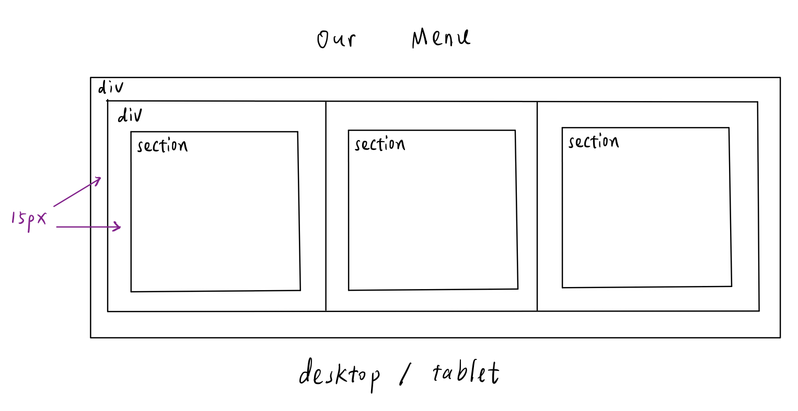

# Assignment 2
## Table of contents
- [Solution](#solution)
- [TO DO](#to-do)

## Solution
- Spacing
    - We call
        - Section spacing: the spacing between sections 
        - Window spacing: the spacing between the edges of the section and the edges of the brower window

    - In the desktop/table view, section spacing is equal to window spacing

        
        - The spacings are all 30px

    - In the mobile view, window spacing is twice than section spacing

        
        - Window spacing: 30px
        - Section spacing: 15px
        
## TO DO
- The way to push down the dummy text in order to not overlap with section title is to give a `30px` top padding of the `<section>`
    - Is there a better method to fit with the section tile?